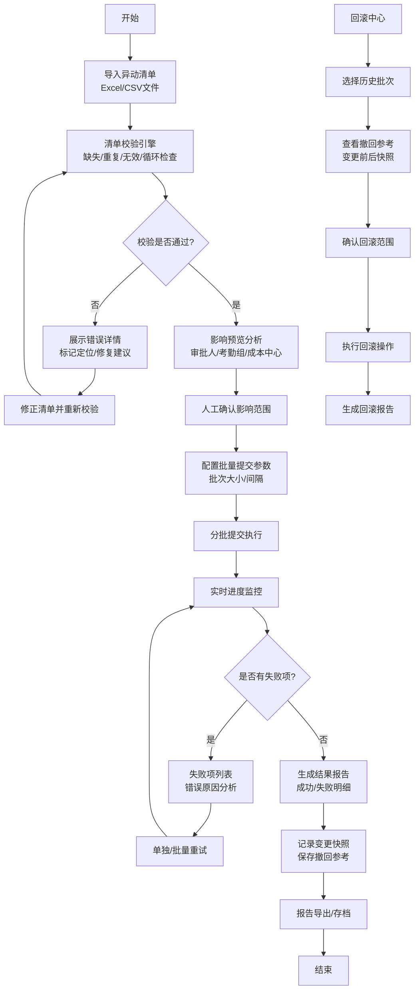

## 1. 产品概述

人力资源异动批量处理自动化工具，旨在帮助HR人员在组织调整、岗位调动和汇报关系变更场景下，通过批量导入、智能校验、预览确认、分批执行和结果追溯的完整流程，大幅减少手工录入工作，降低人为错误率。

- 核心目标：将HR从重复繁琐的异动录入工作中解放出来，提供端到端的批量异动管理能力
- 目标用户：企业HR专员、HRBP、组织发展专员
- 核心价值：提高异动处理效率80%以上，确保数据一致性，提供完整的变更追溯能力

## 2. 核心功能

### 2.1 用户角色
| 角色 | 描述 | 核心权限 |
|------|------|----------|
| HR专员 | 日常异动处理人员 | 导入清单、校验、预览、提交、查看报告、执行回滚 |
| HR管理员 | 系统配置管理员 | 基础数据维护、部门岗位配置、审批流程设置 |

### 2.2 功能模块
1. **清单校验模块**：导入异动清单，执行完整性和逻辑校验
2. **影响预览模块**：预览异动对审批人、考勤组、成本中心的影响
3. **批量提交模块**：分批提交异动，支持失败项单独重试
4. **回滚记录模块**：记录变更历史，提供撤回参考和执行回滚
5. **结果报告模块**：生成成功/失败明细，支持导出报告

### 2.3 页面详情
| 页面名称 | 模块名称 | 功能描述 |
|-----------|-------------|---------------------|
| 主工作台 | 异动清单导入 | 支持Excel/CSV格式导入，文件模板下载，拖拽上传 |
| 主工作台 | 清单校验引擎 | 缺失字段检查、重复记录检查、无效部门/岗位检查、循环汇报关系检查、日期合法性检查 |
| 主工作台 | 校验结果展示 | 分类型错误列表、错误定位、一键修复建议、统计摘要 |
| 影响分析页 | 审批人预览 | 展示异动前后审批链对比，标记需人工确认的审批路径 |
| 影响分析页 | 考勤组预览 | 展示异动员工考勤组变更，冲突标记 |
| 影响分析页 | 成本中心预览 | 展示成本中心归属变更，财务影响预估 |
| 批量执行页 | 分批提交配置 | 设置批次大小、提交间隔、并发数 |
| 批量执行页 | 执行进度监控 | 实时进度条、成功/失败计数、当前批次信息 |
| 批量执行页 | 失败项重试 | 失败项列表、错误原因、单独重试/批量重试 |
| 回滚中心页 | 变更记录列表 | 历史异动批次、操作人、时间、变更数量 |
| 回滚中心页 | 撤回参考信息 | 变更前后快照、影响范围说明、回滚风险提示 |
| 回滚中心页 | 执行回滚 | 选择回滚范围、确认回滚、回滚执行日志 |
| 报告中心页 | 成功/失败明细 | 分状态列表、详细错误信息、操作日志 |
| 报告中心页 | 报告导出 | Excel格式导出、PDF预览、邮件发送 |
| 报告中心页 | 统计仪表盘 | 异动类型统计、部门分布、趋势图表 |

## 3. 核心流程

用户从导入异动清单开始，经过校验修正后预览影响范围，确认无误后分批提交执行，系统实时监控执行进度，失败项可单独重试，执行完成后生成详细报告，所有变更记录入库支持后续回滚操作。

## 4. 用户界面设计

### 4.1 设计风格
- **主色调**：专业蓝色系 `#1E40AF`（深蓝）作为主色，体现企业级工具的专业感和可信度
- **辅助色**：成功绿 `#059669`、警告橙 `#D97706`、错误红 `#DC2626`、信息蓝 `#0284C7`
- **中性色**：以 Slate 色系为基础，打造层次感
- **按钮风格**：圆角8px的方形按钮，带微妙阴影和hover过渡，主按钮使用蓝白渐变
- **字体**：标题使用 "Noto Sans SC"（思源黑体）加粗，正文使用同体系常规字重，配合数字等宽字体
- **布局风格**：卡片式布局配合顶部导航栏，采用分区Tab导航，内容区使用Grid分栏
- **图标风格**：使用 Lucide 线性图标，保持24px标准尺寸，配合状态色彩

### 4.2 页面设计概述
| 页面名称 | 模块名称 | UI元素 |
|-----------|-------------|-------------|
| 主工作台 | 导入区 | 大尺寸拖拽上传框、文件格式提示、模板下载按钮、渐变边框 |
| 主工作台 | 校验区 | 四象限校验统计卡片、错误类型分组折叠面板、行内错误标记 |
| 影响分析页 | 预览对比 | 异动前后双栏对比布局、箭头指示变更、高亮标记变化项 |
| 影响分析页 | 影响列表 | 三栏Tab切换（审批人/考勤组/成本中心）、彩色状态标签 |
| 批量执行页 | 进度区 | 大型进度条组件、动态数字计数器、批次时间线 |
| 批量执行页 | 执行控制 | 暂停/继续/取消按钮组、执行参数配置抽屉 |
| 回滚中心页 | 记录列表 | 时间线布局、批次摘要卡片、风险等级徽章 |
| 回滚中心页 | 撤回参考 | 左右分栏对比快照、JSON格式化展示、风险提示Banner |
| 报告中心页 | 明细表格 | 带筛选排序的增强表格、状态色块、行内详情展开 |
| 报告中心页 | 统计区 | 环形图（成功率）、柱状图（部门分布）、折线图（趋势） |

### 4.3 响应式设计
- 采用桌面端优先设计，最小支持宽度1280px
- 左侧导航在1440px以下收起为图标模式
- 数据表格支持横向滚动，保持列完整性
- 移动端（<1024px）采用单列堆叠布局，Tab切换改为底部导航

### 4.4 交互动效
- 页面加载：主内容区元素错落出现（staggered fade-in + translate）
- 校验动画：校验过程进度条脉冲动画，错误标记逐个出现
- 提交执行：成功/失败项以列表形式逐条动态添加，带滑入效果
- 状态切换：成功/失败/警告状态切换带平滑过渡和颜色闪烁提示
- 卡片悬浮：卡片hover时轻微上浮+阴影增强，配合微妙缩放
