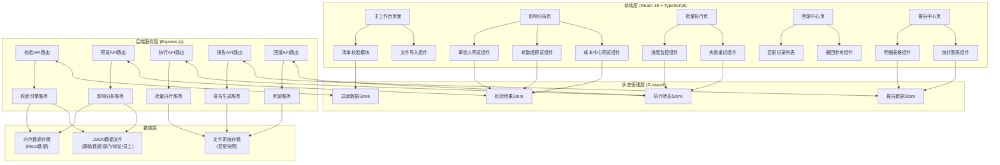
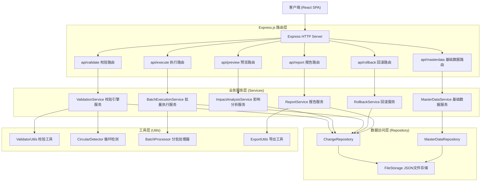
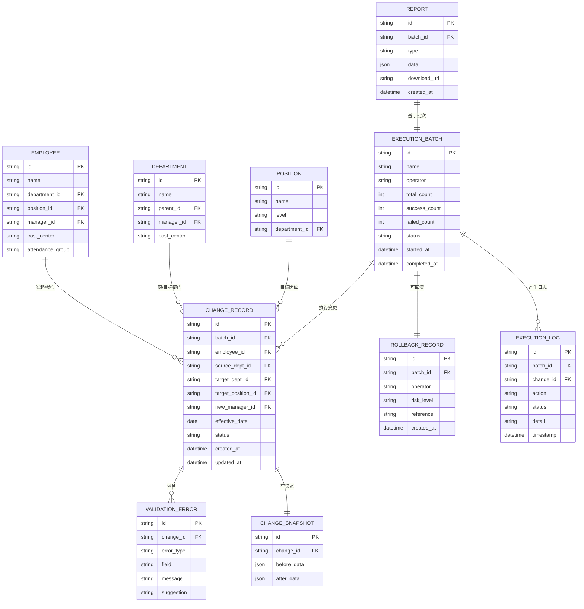

## 1. 架构设计



## 2. 技术描述

- **前端框架**: React@18 + TypeScript@5
- **构建工具**: Vite@5
- **样式方案**: TailwindCSS@3 + 自定义CSS变量主题系统
- **状态管理**: Zustand@4
- **路由管理**: React Router DOM@6
- **UI组件库**: Lucide React（图标）+ 自研业务组件
- **数据处理**: PapaParse（CSV解析）+ SheetJS（Excel处理）
- **图表可视化**: Recharts@2
- **初始化工具**: vite-init
- **后端框架**: Express@4 + TypeScript
- **数据存储**: 内存数据存储 + JSON文件持久化（Mock模式）
- **开发语言**: 全栈 TypeScript，前后端共享类型定义

## 3. 路由定义

| 路由 | 页面名称 | 用途 |
|-------|---------|------|
| / | 主工作台 | 异动清单导入、校验结果展示、数据编辑 |
| /impact | 影响分析 | 审批人、考勤组、成本中心变更预览 |
| /execute | 批量执行 | 分批提交配置、进度监控、失败重试 |
| /rollback | 回滚中心 | 变更记录列表、撤回参考、执行回滚 |
| /report | 报告中心 | 成功/失败明细、统计图表、报告导出 |

## 4. API 定义

```typescript
// 共享类型定义
export interface EmployeeChange {
  id: string;
  employeeId: string;
  employeeName?: string;
  sourceDepartment: string;
  targetDepartment: string;
  targetPosition: string;
  effectiveDate: string;
  newManagerId: string;
  newManagerName?: string;
  status: 'pending' | 'validated' | 'submitting' | 'success' | 'failed' | 'rolled_back';
  errors?: ValidationError[];
}

export interface ValidationError {
  type: 'missing' | 'duplicate' | 'invalid_department' | 'invalid_position' | 'invalid_manager' | 'circular_reporting' | 'invalid_date';
  field: string;
  message: string;
  suggestion?: string;
}

export interface ImpactPreview {
  approvers: ApproverChange[];
  attendanceGroups: AttendanceChange[];
  costCenters: CostCenterChange[];
}

export interface ApproverChange {
  employeeId: string;
  employeeName: string;
  originalApprovers: string[];
  newApprovers: string[];
  needsReview: boolean;
}

export interface AttendanceChange {
  employeeId: string;
  employeeName: string;
  originalGroup: string;
  newGroup: string;
  hasConflict: boolean;
}

export interface CostCenterChange {
  employeeId: string;
  employeeName: string;
  originalCenter: string;
  newCenter: string;
  budgetImpact: number;
}

export interface BatchExecutionConfig {
  batchSize: number;
  intervalMs: number;
  retryCount: number;
}

export interface ExecutionResult {
  batchId: string;
  totalCount: number;
  successCount: number;
  failedCount: number;
  successItems: EmployeeChange[];
  failedItems: (EmployeeChange & { failReason: string })[];
  startTime: string;
  endTime: string;
}

export interface RollbackRecord {
  batchId: string;
  operator: string;
  operationTime: string;
  changeCount: number;
  riskLevel: 'low' | 'medium' | 'high';
  beforeSnapshot: EmployeeChange[];
  afterSnapshot: EmployeeChange[];
  rollbackReference: string;
}

// API 请求/响应类型
export interface ValidateRequest { changes: EmployeeChange[] }
export interface ValidateResponse { 
  validChanges: EmployeeChange[];
  invalidChanges: EmployeeChange[];
  summary: { 
    total: number; valid: number; invalid: number;
    errorsByType: Record<string, number>;
  };
}

export interface PreviewRequest { changes: EmployeeChange[] }
export interface PreviewResponse { impact: ImpactPreview; summary: { needsReviewCount: number; conflictCount: number; totalBudgetImpact: number } }

export interface ExecuteRequest { changes: EmployeeChange[]; config: BatchExecutionConfig }
export interface ExecuteResponse { executionId: string; config: BatchExecutionConfig }

export interface ReportRequest { batchId: string }
export interface ReportResponse { result: ExecutionResult; exportUrl?: string }
```

## 5. 服务器架构图



## 6. 数据模型

### 6.1 数据模型定义



### 6.2 初始数据定义

```typescript
// 部门基础数据
const DEPARTMENTS = [
  { id: 'D001', name: '技术研发部', parentId: null, managerId: 'E001', costCenter: 'CC-RD-001' },
  { id: 'D002', name: '前端开发组', parentId: 'D001', managerId: 'E002', costCenter: 'CC-RD-001' },
  { id: 'D003', name: '后端开发组', parentId: 'D001', managerId: 'E003', costCenter: 'CC-RD-001' },
  { id: 'D004', name: '产品设计部', parentId: null, managerId: 'E004', costCenter: 'CC-PD-001' },
  { id: 'D005', name: '产品经理组', parentId: 'D004', managerId: 'E005', costCenter: 'CC-PD-001' },
  { id: 'D006', name: 'UI设计组', parentId: 'D004', managerId: 'E006', costCenter: 'CC-PD-001' },
  { id: 'D007', name: '市场营销部', parentId: null, managerId: 'E007', costCenter: 'CC-MK-001' },
  { id: 'D008', name: '人力资源部', parentId: null, managerId: 'E008', costCenter: 'CC-HR-001' },
  { id: 'D009', name: '财务部', parentId: null, managerId: 'E009', costCenter: 'CC-FN-001' },
];

// 岗位基础数据
const POSITIONS = [
  { id: 'P001', name: '技术总监', level: 'L8', departmentId: 'D001' },
  { id: 'P002', name: '前端架构师', level: 'L7', departmentId: 'D002' },
  { id: 'P003', name: '高级前端工程师', level: 'L6', departmentId: 'D002' },
  { id: 'P004', name: '前端工程师', level: 'L5', departmentId: 'D002' },
  { id: 'P005', name: '后端架构师', level: 'L7', departmentId: 'D003' },
  { id: 'P006', name: '高级后端工程师', level: 'L6', departmentId: 'D003' },
  { id: 'P007', name: '产品总监', level: 'L8', departmentId: 'D004' },
  { id: 'P008', name: '高级产品经理', level: 'L6', departmentId: 'D005' },
  { id: 'P009', name: '产品经理', level: 'L5', departmentId: 'D005' },
  { id: 'P010', name: 'UI设计师', level: 'L5', departmentId: 'D006' },
  { id: 'P011', name: '市场总监', level: 'L8', departmentId: 'D007' },
  { id: 'P012', name: 'HRBP', level: 'L5', departmentId: 'D008' },
  { id: 'P013', name: '财务会计', level: 'L5', departmentId: 'D009' },
];

// 员工基础数据
const EMPLOYEES = [
  { id: 'E001', name: '张伟', departmentId: 'D001', positionId: 'P001', managerId: null, costCenter: 'CC-RD-001', attendanceGroup: 'AT-TECH' },
  { id: 'E002', name: '李娜', departmentId: 'D002', positionId: 'P002', managerId: 'E001', costCenter: 'CC-RD-001', attendanceGroup: 'AT-TECH' },
  { id: 'E003', name: '王强', departmentId: 'D003', positionId: 'P005', managerId: 'E001', costCenter: 'CC-RD-001', attendanceGroup: 'AT-TECH' },
  { id: 'E004', name: '刘洋', departmentId: 'D004', positionId: 'P007', managerId: null, costCenter: 'CC-PD-001', attendanceGroup: 'AT-STD' },
  { id: 'E005', name: '陈静', departmentId: 'D005', positionId: 'P008', managerId: 'E004', costCenter: 'CC-PD-001', attendanceGroup: 'AT-STD' },
  { id: 'E006', name: '赵敏', departmentId: 'D006', positionId: 'P010', managerId: 'E004', costCenter: 'CC-PD-001', attendanceGroup: 'AT-STD' },
  { id: 'E007', name: '孙磊', departmentId: 'D007', positionId: 'P011', managerId: null, costCenter: 'CC-MK-001', attendanceGroup: 'AT-SALES' },
  { id: 'E008', name: '周芳', departmentId: 'D008', positionId: 'P012', managerId: null, costCenter: 'CC-HR-001', attendanceGroup: 'AT-STD' },
  { id: 'E009', name: '吴涛', departmentId: 'D009', positionId: 'P013', managerId: null, costCenter: 'CC-FN-001', attendanceGroup: 'AT-STD' },
  { id: 'E010', name: '郑小明', departmentId: 'D002', positionId: 'P004', managerId: 'E002', costCenter: 'CC-RD-001', attendanceGroup: 'AT-TECH' },
  { id: 'E011', name: '黄丽', departmentId: 'D002', positionId: 'P003', managerId: 'E002', costCenter: 'CC-RD-001', attendanceGroup: 'AT-TECH' },
  { id: 'E012', name: '林浩', departmentId: 'D003', positionId: 'P006', managerId: 'E003', costCenter: 'CC-RD-001', attendanceGroup: 'AT-TECH' },
  { id: 'E013', name: '何婷', departmentId: 'D005', positionId: 'P009', managerId: 'E005', costCenter: 'CC-PD-001', attendanceGroup: 'AT-STD' },
  { id: 'E014', name: '罗宇', departmentId: 'D006', positionId: 'P010', managerId: 'E006', costCenter: 'CC-PD-001', attendanceGroup: 'AT-STD' },
  { id: 'E015', name: '谢雯', departmentId: 'D002', positionId: 'P004', managerId: 'E002', costCenter: 'CC-RD-001', attendanceGroup: 'AT-TECH' },
];
```
